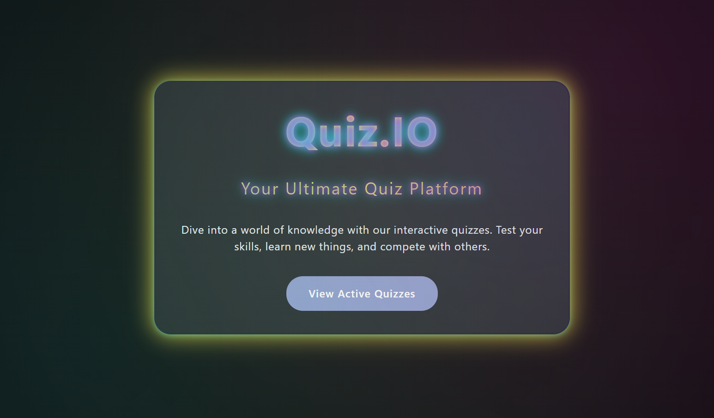
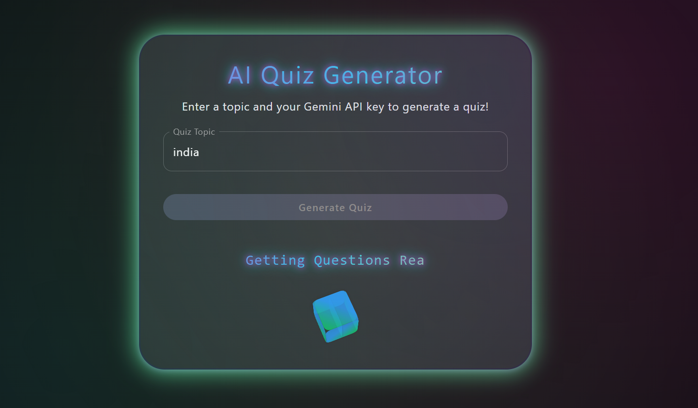

# 🧠 Quiz.io – AI Powered Quiz Platform

🚀 [Live Demo](https://quiz-io-4k16.onrender.com)

Welcome to **Quiz.io**! This is a modern, interactive quiz platform that lets you:

- 📝 Take curated quizzes on various topics
- 🤖 Generate custom AI-powered quizzes on any topic using Gemini AI
- 📊 Instantly see your results with animated charts
- 🎨 Enjoy a beautiful, responsive UI with 3D loading animations

---

## 🌟 Features

- **AI Quiz Generator:** Enter any topic, and let Gemini AI create a 5-question multiple choice quiz with explanations.
- **Info Boxes:** Each AI question comes with a short, clear info/explanation after you answer.
- **Animated 3D Loader:** Fun 3D animation and typing effect while questions are being generated.
- **Results Pie Chart:** See your score visualized instantly after each quiz.
- **Consistent Design:** Unified button and card styles across all pages.
- **Easy Navigation:** Clean, modern homepage and quiz experience.
- **Regenerate Quizzes:** Instantly generate more questions on the same topic with one click.

---

## 🖼️ Screenshots

### Home Page

### AI Quiz Page

---

## 🌍 Try it Now!

👉 **[Live Demo](https://quiz-io-4k16.onrender.com)**

---

## 💡 How it works
1. Pick a topic or use the AI Quiz option.
2. For AI quizzes, enter your topic and click Generate – watch the 3D animation!
3. Answer questions, get instant feedback, and see explanations.
4. View your score with a pie chart and generate more quizzes instantly.

---

## ✨ Tech Stack
- React + TypeScript + Vite
- Material UI (MUI)
- Chart.js & react-chartjs-2
- Gemini AI API (for AI quizzes)

---

Enjoy learning and challenging yourself with **Quiz.io**! 🎉
